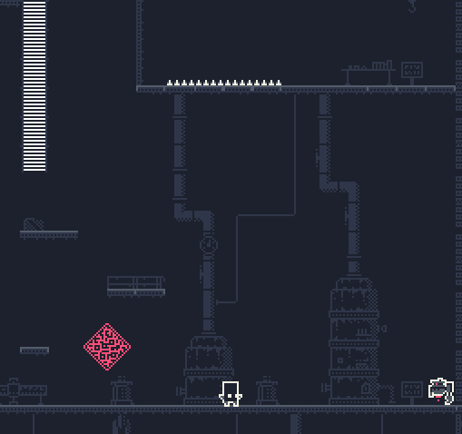

# T2DEngine
A 2D tile based game engine, with a companion DEMO showcasing some its features.

# Motivation
The main reason behind the construction of the engine, was to have a first hand learning experience on how to construct a component based 2D game engine. 

# DEMO 


# Tech/Framework used
  - [OpenGL/GLFW](http://www.glfw.org/) and [GLEW](http://glew.sourceforge.net/) for rendering. 
  - [stb_image](https://github.com/nothings/stb) for image loading. 
  - [CMake](https://cmake.org/) for generating the build files.
  - [Tiled Level Editor](https://www.mapeditor.org/) for creating the maps used by the engine, i.e, the tmx files.
  - [TexturePacker](https://www.codeandweb.com/texturepacker) for generating the sprite atlases and the corresponding xml files used by the engine.

# Some core features
T2DEngine is comprised of a group of modules, each one implementing a core functionality. Some of them are:
  - Math, which implements all the 2D vector and matrix math used by the engine and DEMO.
  - Mem, which provides a function to allocate aligned memory blocks and defines both a pool data structure to manage memory blocks of the same size and a generic memory allocator.
  - Utility defines types and data structures that are used by different parts of the engine, such as: a timer class and an implementation of the crc32 algorithm.
  - Io implements all the input handling.
  - Rms defines a generic interface to create resources and resource managers.
  - Tmap defines all the data structures necessary to integrate the Engine with the Tiled Level Editor tool. Allowing us to
    to load .tmx files and, not only render the Tile Map, but also load data regarding collision geometry,
    “damage areas” and objects spawn positions.
  - Gfx is responsible with integrating the Engine with OpenGL/GLFW. Providing an interface for rendering -- sprites and tiles, using a batching technique
    -- and defining the Engine's Animation System.

Some modules in T2D can be used as they are, or with some very minor modifications, on most game projects. The classes defined in these modules are, in most cases, decoupled from the rest of the engine
and implement features that are necessary in most game projects. Therefore, they could be extracted from T2D and used on other games. A few of them are.
  - The [pool data structure](https://github.com/mateusgondim/T2DEngine/blob/master/engine/source/mem/source/src/Pool_allocator.hpp), which manages a collection of memory blocks of the same size. 
  - The powerful Sprite Animation system, used to construct and control Animation State Machines from sprite atlases.
  - The implementation of a [string_id type](https://github.com/mateusgondim/T2DEngine/blob/master/engine/source/utility/source/src/string_id.hpp), which uses the crc-32 algorithm to
    generate a 32-bit unsigned value from a string.
  - The SID preprocessor tool, which parses the source code and replaces string constants with their correspondent hashed integer values.
    Using SID, we can program in terms of string constants knowing that, before building the game, these strings will be replaced by their hashed values,
    which can be compared in constant time and have a smaller memory footprint.
  - The flexible Event System, that allow us to create and send custom messages between Game Objects.

  # Code Example of some key features
  - Pool data structure usage
  ```c++
  //creates a memory pool of 4 elements, each with a size of 5 bytes and with a 4-byte aligment requirement 
  Pool_allocator pool(4, 5, 4); 
  
  void *chunk_01, *chunk_02;
  
  chunk_01 = pool.get_element();
  chunk_02 = pool.get_element();
  
  std::cout << pool << std::endl;
  pool.free_element(chunk_02);  
  
  ```
  - Constructing a Animator controller's state machine
  ```c++
  gfx::Animator_controller *pcontroller(new gfx::Animator_controller());
  
  
  // Creating Animations
  // Notice the use of the SID preprocessor tool! these strings will be replaced by 
  // their hashed integer values BEFORE building the application
  gfx::Animation_player player_idle_anim(gfx::Animation({ SID('hero_idle01'),
                                                          SID('hero_idle02'),
							  SID('hero_idle03'),
                                                          SID('hero_idle04') }, 4));

  gfx::Animation_player player_running_anim(gfx::Animation({ SID('hero_running01'),
                                                             SID('hero_running02'),
                                                             SID('hero_running03'),
                                                             SID('hero_running04'),
                                                             SID('hero_jumping01'),
                                                             SID('hero_jumping02'),
                                                             SID('hero_jumping03'),
                                                             SID('hero_jumping04') }, 10));
  
  // Adding parameters to the state machine
  pcontroller->add_parameter("is_running", gfx::Animator_controller_parameter::Type::BOOL);
  pcontroller->add_parameter("is_jumping", gfx::Animator_controller_parameter::Type::BOOL);
  
  // Adding states
  gfx::Animator_state & player_idle_state = pcontroller->add_state("player_idle", player_idle_anim);
  gfx::Animator_state & player_running_state = pcontroller->add_state("player_running", player_running_anim);
  
  // Adding a transition
  gfx::Animator_state_transition & idle_to_running = player_idle_state.add_transition("player_running");
  //setting a Transition's condition
  idle_to_running.add_condition(gfx::Animator_condition::Mode::EQUALS, 1, "is_running");
  ```
  - Setting up a Camera_2d object
  ```c++
  //this camera will render a screen with width= 'tiles_per_screen_width' and height = "tiles_per_screen_height", using orthographic
  //projection
  //the other parameters are used for scrolling
  m_camera.init(tile_wld_width, tile_wld_height, tiles_per_screen_width, tiles_per_screen_height, tile_map_width, tile_map_height, map_origin);
  ```
  # Building the Engine/game
 T2DEngine uses CMake to generate all the necessary build files, so you need to first download and install [it](https://cmake.org/).
 After installing CMake, you need to install the [GLFW](http://www.glfw.org/) and [GLEW](http://glew.sourceforge.net/) libraries. Having installed both libraries, follow the next steps:
  - Create a build folder inside the T2DEngine/engine directory and run CMake, using T2DEngine/engine/source has its source directory and the newly created directory as the build directory.
    T2DEngine already have a FindGLEW and FindGLFW file to locate both libraries, but, if CMake fails to find them, you will need to set
    up the libraries' file and include directories(i recommend using the CMake GUI for this).
    After this process, you should have all the necessary files to build the engine, i.e, the Visual studio solution if running on Windows or, the makefiles if running on a Unix system.
  - Finally, repeat the same previous step to build the game application.
  # API Reference
  Being developed
